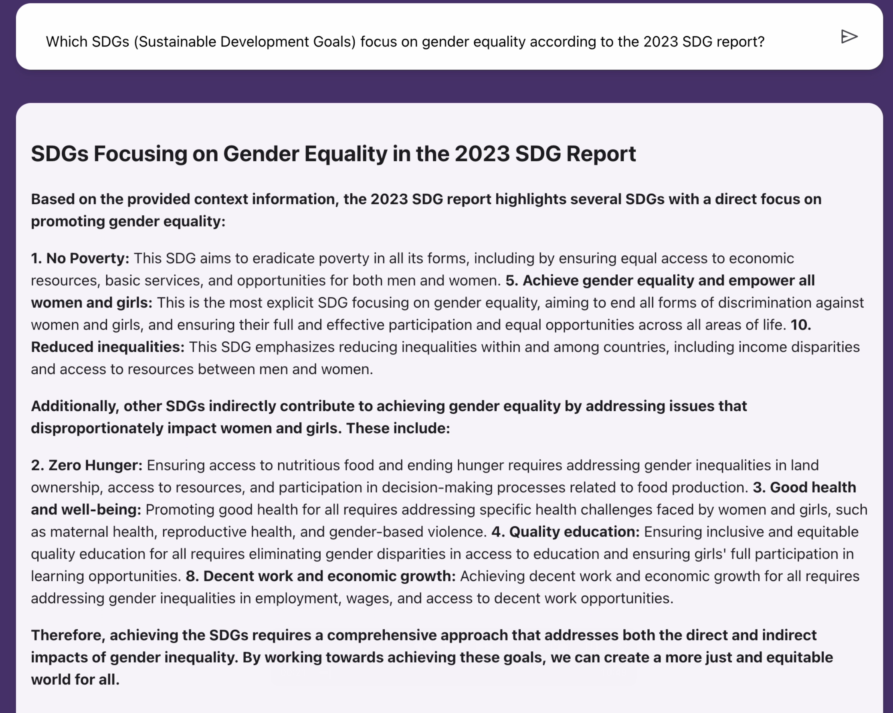

## Gender-Equity-Navigator

Gender Equity Navigator (GEN) is a powerful tool designed to address the critical global challenge of gender equity by providing organizations with data-driven insights and recommendations. Leveraging Retrieval-Augmented Generation (RAG) technology, GEN utilizes a comprehensive repository of global reports, articles, and research to offer clear, actionable guidance on gender equity topics. Users can ask complex questions and receive in-depth responses on subjects like diversity policies, gender pay disparities, and leadership representation.

Aligned with UN Sustainable Development Goal (SDG) 5 on Gender Equality, GEN supports informed decision-making and facilitates impactful, measurable progress toward gender equity.

### Preview of the Application

### How It Was Built
Gender Equity Navigator combines various technologies to create a robust, interactive experience:

- **Data Storage:** Google Cloud Storage buckets to store PDF reports and other resources.
- **Vector Indexing:** Vertex AI Vector Search to manage and retrieve indexed content.
- **Language Model:** Gemini LLM, used in conjunction with the LlamaIndex framework, provides intelligent responses to user queries.
- **Application Framework:** Mesop was employed to create a streamlined app interface.
- **Deployment:** The application is containerized and deployed on Google Cloud Run, ensuring scalability and accessibility.
This architecture, which integrates RAG with comprehensive data from reports and research, enables GEN to offer both quick responses and in-depth insights that are tailored to user needs.

### Features
With Gender Equity Navigator, users can:

- **Query Gender Equity Topics:** Get clear, customized insights on gender pay gaps, diversity policies, and leadership representation.
- **Receive Data-Driven Recommendations:** Support gender equality initiatives with AI-driven analysis and recommendations based on the latest research.
- **Make Informed Decisions:** Leverage evidence-based insights to drive gender equality policies that align with organizational goals and global standards.

### Try It Out
Access GEN at [gender-equity-navigator](https://gender-equity-nav-135008850867.us-central1.run.app/) and explore gender equity topics with sample queries.

### Sample Query Categories and Examples

#### Gender-Specific Inquiries

- “What is the current status of the gender pay gap according to the Gender Snapshot reports?”
- “How have gender equality indicators evolved from 2020 to 2024 in the Gender Snapshot series?”
- “Can you summarize the progress in women’s employment in 2023 compared to 2022?”

#### Gender Equality in Sustainable Development Goals

- “Which SDGs focus on gender equality according to the 2023 SDG report?”
- “How does gender equality contribute to the 2030 SDG agenda, as stated in the 2023 report?”

#### Gender and Development Reports

- “What are the key findings about gender inclusion in education from the ‘UN Women Annual Report 2023’?”
- “What does the 2022 SDG report say about gender parity in leadership roles?”

#### Sustainability Goals and Gender

- “How does gender inequality impact sustainability goals according to the 2024 SDG report?”
- “What are the key challenges in achieving gender equality within the sustainability development goals?”

#### Data and Statistics

- “Can you give a breakdown of gender statistics in the ‘UN Women Annual Report 2017’?”
- “What are the main takeaways from ‘The Sustainable Development Goals Report 2020’ regarding gender equality?”

#### Regional and International Insights

- “What are the gender inequality issues faced by women in the Asia-Pacific region as described in the 2014 report?”
- “According to the ‘UNW Gender Snapshot 2021,’ what are the most pressing gender issues in sub-Saharan Africa?”

#### Social and Economic Dimensions

- Economic Empowerment: “What does the Gender Snapshot 2020 say about women’s economic empowerment?”
- Health and Safety: “How does the ‘UN Women Annual Report’ discuss women’s health and safety?”
- Women’s Rights and Advocacy: “What strategies are highlighted in the ‘HeForShe Alliance Impact Report 2024’ to enhance women’s rights?”